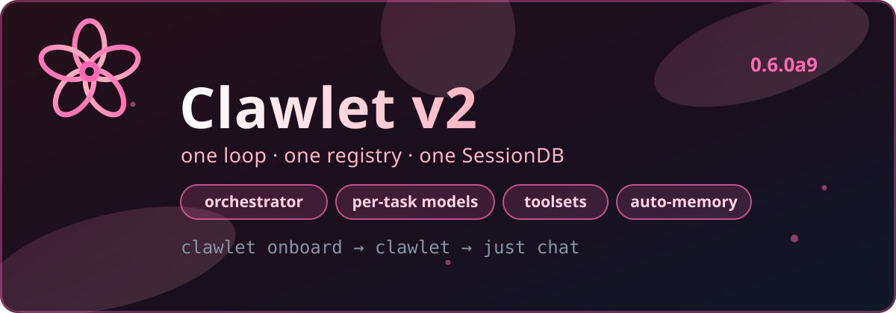

# 🌸 Clawlet (`0.6.0a9`)

<div align="center">



**A lightweight AI agent framework with identity awareness**

[](https://www.python.org/downloads/)
[](https://opensource.org/licenses/MIT)
[](CHANGELOG.md)

*Your agent picks the right brain, the right tools, and the right budget — for every single request.*

[Quick Start](#-quick-start) • [How it works](#-how-it-works) • [TUI](#-tui) • [Config](#-config) • [Commands](#-commands) • [Providers](#-providers) • [Docs](#-docs)

</div>

---

## Why Clawlet?

Clawlet is a **lightweight** agent framework for developers who want an assistant that knows who it is and acts on its own — without a heavy platform:

- 🏠 **Local-first** — run Ollama or LM Studio, no cloud required
- 🎭 **Identity awareness** — the agent reads `SOUL.md`, `USER.md`, `MEMORY.md`
- 🧠 **A specialist per task** — strong model for code, cheap/fast model for chat, local model for memory
- 🧰 **Least-privilege tools** — each task only sees the tools it needs
- 💾 **Memory that maintains itself** — auto-consolidation every 24h, automatic history compression
- 🌸 **Terminal-native console** — just type `clawlet`, no browser tab needed
- 🔒 **Security-first** — hardened shell tool, secret masking, safe defaults
- 🌐 **Web search** — Brave Search API integration for up-to-date answers
- 🔌 **Skills** — modular capabilities loaded on demand, never stuffed into every prompt

---

## 🚀 Quick Start

### Install

```bash
git clone https://github.com/Kxrbx/Clawlet.git
cd Clawlet
git checkout v2-revamp

uv sync                  # lean core — local-first, no 200MB of chat SDKs
# or
uv sync --extra full    # everything: channels, postgres, monitoring

uv tool install -e .    # expose bare `clawlet` everywhere (editable, tracks this repo)
```

Then just type `clawlet` from any terminal — no activation, no `uv run` prefix.
Need a channel backend in the global install? Add it with `--with`:

```bash
uv tool install --force -e . --with 'python-telegram-bot>=21.11.1,<22'
```

All commands below assume `clawlet` is on your PATH (via the tool install above).
Otherwise activate the venv or prefix with `uv run`, e.g. `uv run clawlet onboard`.

Pick extras à la carte instead:

```bash
uv sync --extra channels-telegram
uv sync --extra channels-discord
uv sync --extra storage-postgres
uv sync --extra monitoring
```

### Set up (recommended)

```bash
clawlet onboard
```

The 8-step wizard walks you through:

1. Provider choice (16+ options)
2. API keys or local model settings
3. Default model
4. Execution mode (`safe` or `full_exec`)
5. Channels (Telegram / Discord)
6. Identity (name, personality)
7. **Per-task models** — e.g. strong model for code, cheap for chat, local for memory
8. Workspace creation (all files generated)

Or go fast:

```bash
clawlet init
# then edit ~/.clawlet/config.yaml
```

### Run

```bash
clawlet validate
clawlet             # full-screen console — no subcommand needed

# or headless / channel mode:
clawlet agent [--channel telegram] [--toolsets coding,browser]
```

Your workspace:

```
~/.clawlet/
├── config.yaml
├── SOUL.md / USER.md / MEMORY.md / HEARTBEAT.md
├── tasks/QUEUE.md
└── memory/
    └── clawlet.db   # sessions + messages + memory, one file
```

---

## 🧠 How it works

```
Inbound → Orchestrator (classify) → spawn(task kind) → sub-agent → synthesize → outbound
```

Every non-trivial message is classified and handed to an **isolated sub-agent** with its own provider, model, tools, and budget. Small talk ("thanks!", "ok 👍") skips the machinery via a fast traced fallback. Sub-agents get a clean slice of history — never your full log — and their lineage is recorded, so sessions and `replay` show parent → child.

### One agent, many brains — per-task models

Nine task kinds, fixed taxonomy, fully overridable:

`code · plan · research · browser · memory · review · ops-tool · chat · scheduled`

```yaml
provider:
  primary: openrouter
  openrouter:
    api_key: "${OPENROUTER_API_KEY}"
    model: "anthropic/claude-sonnet-4"

task_profiles:
  code:   {provider: anthropic, model: claude-sonnet-5-20260203, toolset: coding}
  chat:   {provider: openrouter, model: anthropic/claude-haiku-4, toolset: minimal}
  memory: {provider: ollama, model: llama3.2, toolset: memory-only}
```

Resolution per request: `task_profiles[<kind>] → task_profiles.defaults → provider.primary`. Omit anything — sensible built-ins apply.

See exactly which brain handles what, offline:

```bash
clawlet tasks list
clawlet tasks show code
clawlet tasks test-routing "fix the login bug"
```

### The right tools, nothing more

Named views over one registry — same tools, filtered per task:

| Toolset | Sees | Used for |
|---|---|---|
| `full` | everything (only one that auto-includes future tools) | ops, scheduled jobs |
| `coding` | read + write/edit/shell/http + skills | `code` |
| `browser` | fetch / web search / http | `research`, `browser` |
| `minimal` | read-only + read memory + skill list | `plan`, `review`, `chat` |
| `memory-only` | remember / recall / search / curate / status | `memory` |

```bash
clawlet agent --toolsets coding,browser
```

Each profile already declares its toolset — configure once, forget it.

### Memory that maintains itself

- **Auto-consolidation (24h):** recent daily notes (`memory/YYYY-MM-DD.md`) are promoted into durable memory on their own. Failures are logged, never break your heartbeat tick.
- **Automatic compression:** history compresses by count *or* size (100 msgs / 200k chars). Big tool outputs are capped first, then a short summary + anchor is kept — no LLM call just to trim.
- **Skills on demand:** the prompt carries a one-line-per-skill index (~630 tokens for 50 skills); full skill content loads only when matched.
- **Searchable sessions:** one `clawlet.db` with a `sessions` table (parent lineage, task kind, profile snapshot) and instant full-text search.

Same tools throughout: `remember / recall / search / recent / review / curate / status`.

### Heartbeat & scheduling

The autonomous loop is driven by `HEARTBEAT.md`:

- Empty or comment-only file → heartbeat stays quiet, no API burn
- State persisted under `memory/heartbeat-state.json`
- Cron jobs for recurring work (`clawlet cron list / add / run-now / runs`)

```bash
clawlet heartbeat status
clawlet heartbeat last
clawlet heartbeat enable
clawlet heartbeat disable
```

---

## 🌸 TUI

Bare `clawlet` opens the full-screen Sakura console: chat, sessions, command palette, replay views, approval prompts, log tail.

```bash
clawlet
clawlet tui --workspace ~/.clawlet --model anthropic/claude-sonnet-4-20250514
clawlet logs
```

---

## ⚙️ Config

Minimal complete example:

```yaml
provider:
  primary: openrouter
  openrouter: {api_key: "${OPENROUTER_API_KEY}", model: "anthropic/claude-sonnet-4"}

orchestrator:
  max_iterations: 5
  allow_direct_fallback: true
  trivial_max_chars: 200
  classifier_mode: hybrid   # rules | llm | hybrid
  max_depth: 1

task_profiles:
  code: {provider: anthropic, model: claude-sonnet-5-20260203, toolset: coding}

runtime: {engine: python}
heartbeat: {enabled: true, interval_minutes: 30}
```

```bash
clawlet validate   # catches bad keys, missing credentials, bad task kinds
clawlet config     # view (secrets redacted)
```

### Customizing your agent

`SOUL.md` — personality, values, tone. `USER.md` — your name, timezone, preferences. Plain Markdown, no code changes. See [QUICKSTART.md](QUICKSTART.md) for examples.

---

## 📋 Commands

| Command | What it does |
|---|---|
| `clawlet` / `clawlet tui` | Full-screen terminal console |
| `clawlet onboard` / `init` | Guided (8 steps) / quick setup |
| `clawlet agent [--channel telegram] [--toolsets coding,browser]` | Run the runtime |
| `clawlet tasks list / show <kind> / test-routing "<text>"` | Inspect and test routing offline |
| `clawlet sessions` | List / export stored sessions |
| `clawlet heartbeat status\|last\|enable\|disable` | Heartbeat ops |
| `clawlet replay <run_id>` / `recovery list` | Replay events / resume interrupted runs |
| `clawlet cron list / add / run-now / runs` | Scheduling |
| `clawlet benchmark run` | Perf gates |
| `clawlet models [--list\|--current]` | Browse / switch models |
| `clawlet health [--deep]` / `validate` / `config` | Diagnostics |

---

## 🤖 Providers

16+ providers, one shared codebase, one HTTP pool, global secret masking:

**Cloud** — OpenRouter (100+ models, recommended for variety), OpenAI, Anthropic, Google Gemini, MiniMax, Moonshot (Kimi), Qwen, Z.AI (GLM), GitHub Copilot, Vercel AI, OpenCode Zen, Xiaomi, Synthetic, Venice (uncensored).

**Local (free)** — Ollama, LM Studio.

```yaml
# OpenRouter
provider:
  primary: openrouter
  openrouter: {api_key: "${OPENROUTER_API_KEY}", model: "anthropic/claude-sonnet-4-20250514"}

# Local
provider:
  primary: ollama
  ollama: {base_url: "http://localhost:11434", model: "llama3.2"}
```

Web search via Brave: `web_search: {api_key: "${BRAVE_SEARCH_API_KEY}", enabled: true}`. Structured API calls go through `http_request` with explicit `http_auth_profiles` — credentials are never inferred or logged. See [QUICKSTART.md](QUICKSTART.md) for every provider.

---

## 🔒 Security

- Hardened shell tool (15+ dangerous patterns blocked, `shlex`-parsed, no raw shell)
- Secrets masked in logs, redacted in `clawlet config`, stored with `0600` config permissions
- Least-privilege toolsets per task; approvals for dangerous commands
- Rate limiting + circuit breaker + exponential-backoff retries on providers

---

## 📚 Docs

| Doc | For |
|---|---|
| [QUICKSTART.md](QUICKSTART.md) | Provider-by-provider setup, channels, troubleshooting |
| `docs/runtime-v2.md` | Canonical runtime (pipeline, profiles, toolsets, SessionDB) |
| `clawlet/ARCHITECTURE.md` | Components + data flow deep dive |
| `docs/skills.md`, `docs/skills-api.md` | Skills system |
| `docs/channels.md`, `docs/scheduling.md` | Channels, cron |
| `DEPLOYMENT.md` | Production deployment |
| [CHANGELOG.md](CHANGELOG.md) | Full version history |

---

## 🔄 Coming from v1?

Short version — four breaking changes, no data loss:

1. **Python 3.11+** required (was 3.10+).
2. **`runtime.engine: hybrid_rust` removed** — only `python` is accepted; edit the one line by hand.
3. **Heavy backends are opt-in extras.** A fresh install no longer includes Telegram/Discord/Slack/Postgres. Run `uv sync --extra full` to restore the old footprint, or pick extras à la carte.
4. **Web dashboard and webhooks removed.** The Sakura **TUI** (`clawlet`) replaces the React dashboard; `http_request` + `cron` cover webhook use cases. ~13k lines deleted deliberately — one console, one stack.
5. **Database: nothing to do.** New tables sit next to the existing `messages`; history survives. Missing `orchestrator` / `task_profiles` keys fall back to built-ins.

```bash
clawlet validate   # run after editing config.yaml — it catches all of the above
```

Full per-alpha history: [CHANGELOG.md](CHANGELOG.md) (`0.6.0a1` → `0.6.0a8`). Out of scope for now (v2.1 backlog): 30+ platform gateway, kanban-swarm multi-agents, natural-language cron, Tauri Desktop.

---

## 🤝 Contributing

1. Fork → feature branch → commit → push → PR
2. Checks: `pytest` · `python scripts/release_smoke.py` · `python scripts/release_regression.py`

---

## 📄 License & support

MIT — see [LICENSE](LICENSE).

- Issues: [GitHub Issues](https://github.com/Kxrbx/Clawlet/issues)
- Chat: [GitHub Discussions](https://github.com/Kxrbx/Clawlet/discussions)

<div align="center">

Built with 💕 by the Clawlet team · one loop, one registry, one SessionDB.

</div>
