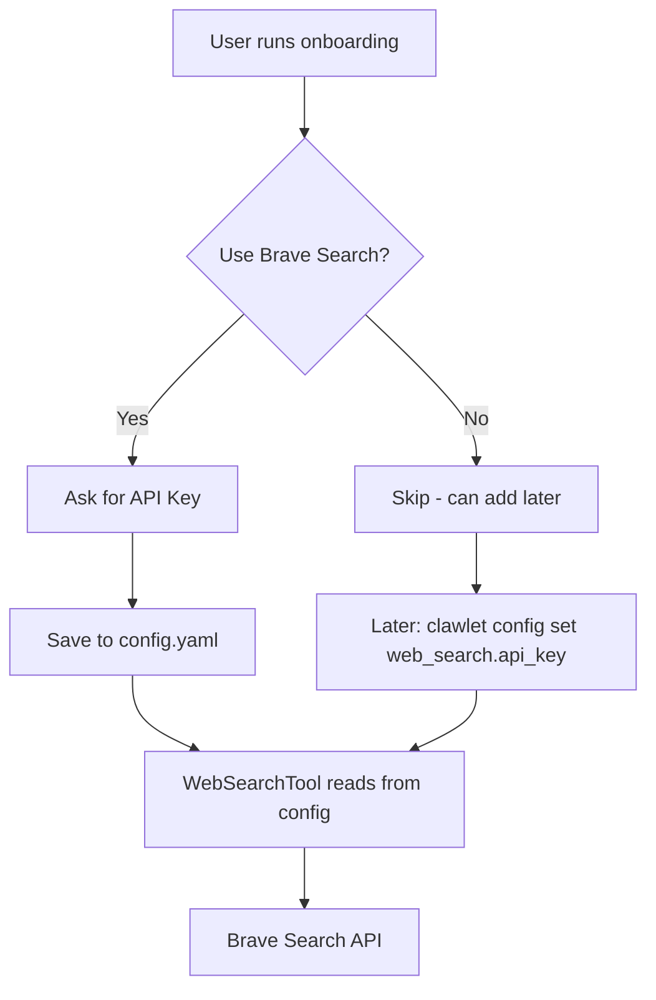

# Brave Search API Support - Implementation Plan

## Overview
Add Brave Search API support to Clawlet with:
- Onboarding prompt asking user if they want to use Brave Search
- If yes, ask for API key and save to config
- If no, skip (can add later via settings)
- Users can also add it later in clawlet settings

---

## Architecture

### Mermaid Diagram - Data Flow



---

## Detailed Implementation Steps

### Step 1: Add BraveSearchConfig to config.py

**File**: `clawlet/config.py`

Add new config class after `VeniceAIConfig`:

```python
class BraveSearchConfig(BaseModel):
    """Brave Search API configuration."""
    api_key: str = Field(default="", description="Brave Search API key")
    enabled: bool = Field(default=False, description="Enable Brave Search")
    max_results: int = Field(default=5, description="Max search results")
    
    @field_validator('api_key')
    @classmethod
    def validate_api_key(cls, v: str) -> str:
        # Allow empty if not enabled
        return v
```

Update `Config` class to include:
```python
class Config(BaseModel):
    # ... existing fields ...
    web_search: BraveSearchConfig = Field(default_factory=BraveSearchConfig)
```

---

### Step 2: Modify Onboarding Flow

**File**: `clawlet/cli/onboard.py`

Add new step after Provider configuration (between Step 2 and Step 3):

```python
# ============================================
# NEW Step 2.5: Brave Search API (Optional)
# ============================================
print_step_indicator(2.5, 6, steps)  # Update total steps
print_section("Web Search", "Enable web search for your agent?")

brave_use = await questionary.confirm(
    "  Use Brave Search API for web searches?",
    default=False,
    style=CUSTOM_STYLE,
).ask_async()

brave_api_key = None
if brave_use:
    console.print("│  [dim]Get your free key at brave.com/search/api[/dim]")
    brave_api_key = await questionary.password(
        "  Enter your Brave Search API key:",
        style=CUSTOM_STYLE,
    ).ask_async()
    if brave_api_key:
        console.print("  [green]✓[/green] Brave Search configured")
```

Update `Config` creation to include:
```python
from clawlet.config import BraveSearchConfig

config = Config(
    provider=provider_config, 
    channels={},
    web_search=BraveSearchConfig(
        api_key=brave_api_key,
        enabled=bool(brave_api_key),
    ) if brave_api_key else BraveSearchConfig()
)
```

---

### Step 3: Update Tool Registry

**File**: `clawlet/tools/__init__.py`

Modify `create_default_tool_registry` to accept config:

```python
def create_default_tool_registry(allowed_dir: str = None, config=None) -> ToolRegistry:
    """Create a default tool registry with all standard tools."""
    registry = ToolRegistry()
    
    # ... existing file tools ...
    
    # Add web search tool with API key from config
    api_key = None
    if config and config.web_search:
        api_key = config.web_search.api_key
    
    registry.register(WebSearchTool(api_key=api_key))
    
    return registry
```

---

### Step 4: CLI Config Command Enhancement

**File**: `clawlet/cli/__init__.py`

Add support for `clawlet config set web_search.api_key` - this may already work with existing config set logic, but we should verify.

---

### Step 5: Environment Variable Fallback

**File**: `clawlet/tools/__init__.py`

Support both config and env var:
```python
import os

api_key = (
    config.web_search.api_key if config and config.web_search else None
) or os.environ.get("BRAVE_SEARCH_API_KEY")
```

---

## Files to Modify

| File | Changes |
|------|---------|
| `clawlet/config.py` | Add BraveSearchConfig class, update Config |
| `clawlet/cli/onboard.py` | Add Brave Search prompt in onboarding |
| `clawlet/tools/__init__.py` | Pass API key from config to WebSearchTool |

---

## UX Flow

### Onboarding Flow
```
Step 1: Choose Provider (16 options)
Step 2: Configure Provider API Key + Model
Step 2.5 (NEW): Web Search
  └─ "Use Brave Search API for web searches?" [Yes/No]
  └─ If Yes: Prompt for API key → Save to config
  └─ If No: Skip (can add later)
Step 3: Messaging Channels
Step 4: Agent Identity  
Step 5: Create Workspace
```

### Later Addition (Settings)
```bash
# Option 1: Edit config directly
clawlet config set web_search.api_key "YOUR_KEY"
clawlet config set web_search.enabled true

# Option 2: Environment variable
export BRAVE_SEARCH_API_KEY="YOUR_KEY"
```
