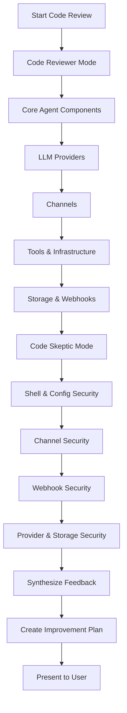

# Clawlet Codebase Review Plan

## Overview

This document outlines a comprehensive code review strategy for the Clawlet codebase using two specialized review modes:

1. **Code Reviewer Mode** - More critical and detailed feedback on code quality, architecture, and best practices
2. **Code Skeptic Mode** - Focused on security vulnerabilities, potential issues, and risk assessment

---

## Project Structure Overview

```
clawlet/
├── agent/           # Core agent logic (loop, identity, memory, router, workspace)
├── bus/             # Message bus for inter-component communication
├── channels/        # Telegram, Discord, WhatsApp, Slack integrations
├── providers/       # 18+ LLM providers (OpenAI, Anthropic, Ollama, etc.)
├── skills/          # Modular skills system
├── webhooks/        # GitHub, Stripe, custom webhook handlers
├── heartbeat/       # Cron-based scheduling
├── storage/         # SQLite and PostgreSQL backends
├── tools/           # Shell, files, web search tools
├── dashboard/       # React + FastAPI dashboard
├── config.py        # Pydantic-based configuration
├── health.py        # Health check system
├── rate_limit.py    # Rate limiting (sliding window + token bucket)
├── retry.py         # Retry logic with circuit breaker
└── exceptions.py    # Custom exception hierarchy
```

---

## Review Scope & Breakdown

### Phase 1: Code Reviewer Mode (Detailed Quality Analysis)

#### 1.1 Core Agent Components
- **Files**: `clawlet/agent/loop.py`, `clawlet/agent/identity.py`, `clawlet/agent/memory.py`, `clawlet/agent/router.py`, `clawlet/agent/tool_parser.py`, `clawlet/agent/workspace.py`
- **Focus Areas**:
  - Code organization and modularity
  - Error handling completeness
  - Memory management and history limits
  - Async/await patterns correctness
  - Dataclass usage and type hints
  - Logging practices

#### 1.2 LLM Providers
- **Files**: `clawlet/providers/*.py` (18+ providers)
- **Focus Areas**:
  - Consistency across provider implementations
  - Error handling patterns
  - Rate limiting integration
  - API key handling
  - Base class abstraction quality
  - Response parsing uniformity

#### 1.3 Communication Channels
- **Files**: `clawlet/channels/discord.py`, `clawlet/channels/slack.py`, `clawlet/channels/telegram.py`, `clawlet/channels/whatsapp.py`, `clawlet/channels/base.py`
- **Focus Areas**:
  - Message parsing and validation
  - Rate limiting per channel
  - Error recovery mechanisms
  - Event handling patterns
  - Connection management

#### 1.4 Tools System
- **Files**: `clawlet/tools/shell.py`, `clawlet/tools/files.py`, `clawlet/tools/registry.py`, `clawlet/tools/web_search.py`
- **Focus Areas**:
  - Shell tool security (already documented)
  - File operation safety
  - Tool registry architecture
  - Result handling patterns

#### 1.5 Infrastructure
- **Files**: `clawlet/config.py`, `clawlet/health.py`, `clawlet/rate_limit.py`, `clawlet/retry.py`, `clawlet/exceptions.py`
- **Focus Areas**:
  - Configuration validation completeness
  - Health check coverage
  - Rate limiting algorithm correctness
  - Circuit breaker implementation
  - Exception hierarchy design

#### 1.6 Storage & Webhooks
- **Files**: `clawlet/storage/*.py`, `clawlet/webhooks/*.py`
- **Focus Areas**:
  - Connection pooling
  - Query parameterization (SQL injection prevention)
  - Webhook signature verification
  - Event parsing safety

---

### Phase 2: Code Skeptic Mode (Security & Risk Assessment)

#### 2.1 Security-Critical Components
- **Files**: `clawlet/tools/shell.py`, `clawlet/config.py`
- **Focus Areas**:
  - Shell command sanitization completeness
  - API key storage and handling
  - Environment variable exposure risks
  - Path traversal vulnerabilities
  - Command injection prevention

#### 2.2 Channel Security
- **Files**: `clawlet/channels/*.py`
- **Focus Areas**:
  - Token storage security
  - Input validation on incoming messages
  - Rate limiting bypass potential
  - Privilege escalation risks
  - Webhook URL exposure

#### 2.3 Webhook Security
- **Files**: `clawlet/webhooks/handlers.py`, `clawlet/webhooks/server.py`
- **Focus Areas**:
  - HMAC signature verification
  - Replay attack prevention
  - Payload validation
  - Timeout handling
  - Error message information leakage

#### 2.4 Provider Security
- **Files**: `clawlet/providers/*.py`
- **Focus Areas**:
  - API key transmission (HTTPS only)
  - Request timeout configuration
  - Response size limits
  - Sensitive data in logs

#### 2.5 Storage Security
- **Files**: `clawlet/storage/*.py`
- **Focus Areas**:
  - SQL injection vulnerabilities
  - Connection string security
  - Sensitive data at rest
  - Database permission model

---

## Review Execution Strategy

### Mermaid Diagram: Review Workflow



---

## Expected Deliverables

### From Code Reviewer Mode
1. **Code Quality Report**: Detailed analysis of each component with:
   - Strengths identification
   - Areas for improvement
   - Code consistency issues
   - Architecture recommendations

2. **Best Practices Gap Analysis**:
   - Pythonic code patterns
   - Type hinting completeness
   - Error handling uniformity
   - Documentation coverage

### From Code Skeptic Mode
1. **Security Vulnerability Assessment**:
   - Critical security issues
   - Medium-risk concerns
   - Low-priority improvements
   - Security best practices recommendations

2. **Risk Assessment Matrix**:
   - Impact vs. Likelihood scoring
   - Mitigation recommendations
   - Security control gaps

---

## Final Improvement Plan

After both review phases, the synthesized feedback will be organized into:

1. **Critical Fixes** (High Priority)
   - Security vulnerabilities
   - Data integrity issues
   - Crash-causing bugs

2. **Recommended Improvements** (Medium Priority)
   - Code quality enhancements
   - Performance optimizations
   - Better error handling

3. **Nice-to-Have Enhancements** (Low Priority)
   - Code organization
   - Documentation
   - Developer experience

---

## Notes

- The Code Reviewer mode will provide more granular, line-by-line feedback
- The Code Skeptic mode will focus on attack vectors and defensive programming
- Each file category will be reviewed sequentially to ensure comprehensive coverage
- The final plan will prioritize items based on impact and effort
