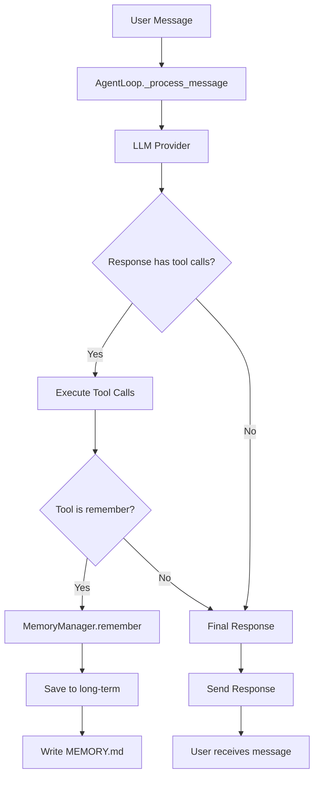

# Agent Memory Integration Plan

## Problem Statement

The `MemoryManager` class exists in [`clawlet/agent/memory.py`](clawlet/agent/memory.py:1) but is **never integrated** into the agent loop or initialized during startup. This means:
- The agent cannot persist memories between conversations
- Long-term memory (MEMORY.md) is never automatically updated
- The memory system exists but is unused

## Current Architecture Analysis

### MemoryManager Capabilities ([`memory.py`](clawlet/agent/memory.py:37))
- **Short-term memory**: In-memory conversation history (max 50 entries)
- **Long-term memory**: Persisted to `MEMORY.md` file in workspace
- **Working memory**: Current task context
- Methods: `remember()`, `recall()`, `recall_by_category()`, `forget()`, `save_long_term()`, `get_context()`

### AgentLoop Issues ([`loop.py`](clawlet/agent/loop.py:54))
- Uses its own `_history` list instead of MemoryManager
- Has no reference to MemoryManager
- Does not call `save_long_term()` after conversations
- No tools exposed for agent to remember/forget

### Startup Gap ([`agent.py`](clawlet/cli/commands/agent.py:42))
- `MemoryManager` is never instantiated
- AgentLoop does not receive a memory parameter
- No memory persistence happens during agent lifecycle

---

## Implementation Plan

### Step 1: Integrate MemoryManager into AgentLoop

**Files to modify:**
- [`clawlet/agent/loop.py`](clawlet/agent/loop.py:1)

**Changes:**
1. Import `MemoryManager` from `clawlet.agent.memory`
2. Add `memory` parameter to `__init__`
3. Replace internal `_history` usage with memory methods where appropriate
4. Call `memory.save_long_term()` periodically or on shutdown

### Step 2: Initialize MemoryManager in Agent Startup

**Files to modify:**
- [`clawlet/cli/commands/agent.py`](clawlet/cli/commands/agent.py:1)

**Changes:**
1. Import `MemoryManager` from `clawlet.agent.memory`
2. Create `MemoryManager(workspace)` instance
3. Pass `memory` parameter to `AgentLoop`

### Step 3: Add Memory Tools to Tool Registry

**Files to modify:**
- Create new file or add to existing tools

**New tools to add:**
1. `remember` - Store important information in memory
   - Parameters: `key`, `value`, `category` (optional), `importance` (optional)
2. `recall` - Retrieve information from memory
   - Parameters: `key`
3. `recall_category` - Get memories by category
   - Parameters: `category`, `limit` (optional)
4. `forget` - Remove a memory
   - Parameters: `key`
5. `get_context` - Get relevant memories for current task

### Step 4: Define Memory Update Triggers

**When should memory be updated?**
1. **Explicit**: Agent uses `remember` tool after user shares important info
2. **Periodic**: After every N conversation turns, save to long-term
3. **On shutdown**: Save all memories before agent stops
4. **Important events**: User introduces themselves, shares preferences, etc.

### Step 5: Add Memory Persistence Logic

**Auto-save strategy:**
- Option A: Save after each `remember()` call (simple but frequent I/O)
- Option B: Save after N conversation turns (batch saves)
- Option C: Save on agent shutdown + periodic (recommended hybrid)

---

## Mermaid Diagram: Memory Flow

---

## Files to Modify

| File | Action | Description |
|------|--------|-------------|
| `clawlet/agent/loop.py` | Modify | Integrate MemoryManager |
| `clawlet/cli/commands/agent.py` | Modify | Initialize MemoryManager |
| `clawlet/tools/__init__.py` or new file | Add | Memory tools |

---

## Testing Plan

1. **Unit tests** for MemoryManager methods
2. **Integration test**: Verify memory persists across agent restarts
3. **Tool test**: Verify remember/recall tools work correctly
4. **End-to-end test**: Full conversation with memory updates
