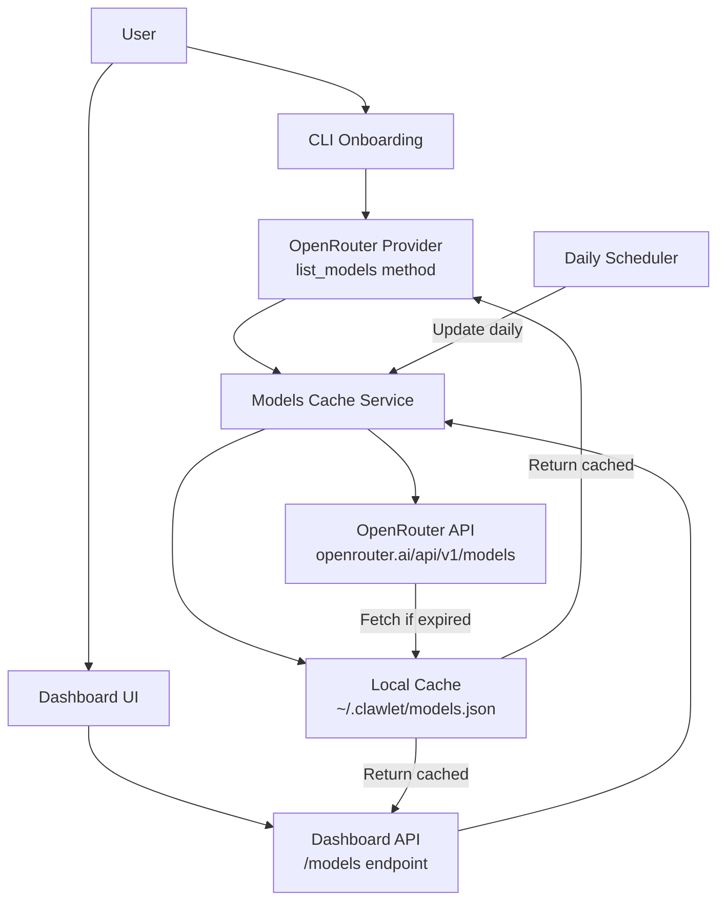

# Implementation Plan: Dynamic OpenRouter Model List

## Problem Statement

Currently, when users select OpenRouter as their model provider, they're only offered 4 hardcoded model choices during onboarding. OpenRouter has hundreds of models available via their API, and users want to see all available models in the dropdown, with daily updates to include new models.

## Architecture Overview



## Implementation Steps

### Step 1: Create Models Cache Service

**File:** `clawlet/providers/models_cache.py`

```python
"""
Models cache service with daily updates.
"""
import json
import asyncio
from pathlib import Path
from datetime import datetime, timedelta
from typing import Optional, List
import httpx
from loguru import logger

from clawlet.providers.openrouter import OpenRouterProvider

CACHE_FILE = Path.home() / ".clawlet" / "models_cache.json"
CACHE_DURATION = timedelta(days=1)

class ModelsCache:
    """Cache for provider models with daily updates."""
    
    def __init__(self, cache_file: Path = CACHE_FILE):
        self.cache_file = cache_file
        self._cache: Optional[dict] = None
        self._lock = asyncio.Lock()
    
    async def get_openrouter_models(self, force_refresh: bool = False) -> List[dict]:
        """Get OpenRouter models, fetching from API if cache is expired."""
        async with self._lock:
            if not force_refresh:
                cached = self._load_cache()
                if cached and not self._is_expired(cached):
                    logger.debug("Using cached OpenRouter models")
                    return cached.get("models", [])
            
            # Fetch fresh models
            models = await self._fetch_openrouter_models()
            self._save_cache(models)
            return models
    
    async def _fetch_openrouter_models(self) -> List[dict]:
        """Fetch models from OpenRouter API."""
        async with httpx.AsyncClient() as client:
            response = await client.get(
                "https://openrouter.ai/api/v1/models",
                headers={"HTTP-Referer": "https://clawlet.ai", "X-Title": "Clawlet"},
                timeout=30.0
            )
            response.raise_for_status()
            data = response.json()
            
            # Extract and sort models
            models = data.get("data", [])
            sorted_models = sorted(models, key=lambda x: x.get("id", ""))
            
            logger.info(f"Fetched {len(sorted_models)} models from OpenRouter")
            return sorted_models
    
    def _load_cache(self) -> Optional[dict]:
        """Load cache from disk."""
        if not self.cache_file.exists():
            return None
        
        try:
            with open(self.cache_file) as f:
                return json.load(f)
        except Exception as e:
            logger.warning(f"Failed to load models cache: {e}")
            return None
    
    def _save_cache(self, models: List[dict]):
        """Save models to cache."""
        self.cache_file.parent.mkdir(parents=True, exist_ok=True)
        
        cache_data = {
            "updated_at": datetime.utcnow().isoformat(),
            "models": models
        }
        
        with open(self.cache_file, "w") as f:
            json.dump(cache_data, f, indent=2)
        
        self._cache = cache_data
        logger.info(f"Saved {len(models)} models to cache")
    
    def _is_expired(self, cached: dict) -> bool:
        """Check if cache is expired."""
        updated_at = cached.get("updated_at")
        if not updated_at:
            return True
        
        try:
            updated = datetime.fromisoformat(updated_at)
            return datetime.utcnow() - updated > CACHE_DURATION
        except ValueError:
            return True

# Global cache instance
_models_cache: Optional[ModelsCache] = None

def get_models_cache() -> ModelsCache:
    """Get global models cache instance."""
    global _models_cache
    if _models_cache is None:
        _models_cache = ModelsCache()
    return _models_cache
```

### Step 2: Add `list_models()` to OpenRouterProvider

**File:** `clawlet/providers/openrouter.py` - Add new method

```python
async def list_models(self, force_refresh: bool = False) -> List[dict]:
    """List all available models from OpenRouter.
    
    Returns a list of model objects with id, name, and other metadata.
    Results are cached and updated daily.
    """
    from clawlet.providers.models_cache import get_models_cache
    
    cache = get_models_cache()
    return await cache.get_openrouter_models(force_refresh=force_refresh)
```

### Step 3: Add `/models` Endpoint to Dashboard API

**File:** `clawlet/dashboard/api.py` - Add new endpoint

```python
from clawlet.providers.models_cache import get_models_cache

class ModelsResponse(BaseModel):
    """Models list response."""
    models: List[dict]
    updated_at: str

@app.get("/models", response_model=ModelsResponse)
async def get_models(provider: str = "openrouter", force_refresh: bool = False):
    """Get available models for a provider."""
    if provider == "openrouter":
        from clawlet.providers.openrouter import OpenRouterProvider
        models = await OpenRouterProvider(api_key="").list_models(force_refresh=force_refresh)
        cache = get_models_cache()
        cached = cache._load_cache()
        updated_at = cached.get("updated_at", "") if cached else ""
        return ModelsResponse(models=models, updated_at=updated_at)
    else:
        raise HTTPException(status_code=400, detail=f"Provider {provider} not supported")
```

### Step 4: Update CLI Onboarding

**File:** `clawlet/cli/onboard.py` - Replace hardcoded models with dynamic fetch

```python
async def _select_openrouter_model() -> str:
    """Select OpenRouter model with dynamic fetching."""
    print_section("Choose Model", "Fetching available models...")
    
    try:
        from clawlet.providers.openrouter import OpenRouterProvider
        provider = OpenRouterProvider(api_key="")
        models = await provider.list_models()
        
        if not models:
            print("  [yellow]! Failed to fetch models, using defaults[/yellow]")
            return _use_default_models()
        
        # Display models in a searchable format
        print(f"  [green]✓[/green] Found {len(models)} models")
        print()
        
        # Show top 10 popular models first
        popular = [m for m in models if m.get("id", "").lower() in [
            "anthropic/claude-sonnet-4", "anthropic/claude-3.5-sonnet",
            "openai/gpt-4o", "openai/gpt-4-turbo", "meta-llama/llama-3.3-70b-instruct"
        ]]
        
        # Allow search/filter
        print_option("s", "Search models", "Filter by name or provider")
        print_option("a", "Show all", f"Show all {len(models)} models")
        
        if popular:
            print()
            print("  [dim]Popular models:[/dim]")
            for i, model in enumerate(popular[:5], 1):
                print_option(f"{i}", model.get("id", "Unknown"), model.get("description", "")[:50])
        
        choice = Prompt.ask("\n  Select or search", default="1")
        
        if choice.lower() == "s":
            return await _search_models(models)
        elif choice.lower() == "a":
            return await _show_all_models(models)
        elif choice.isdigit() and 1 <= int(choice) <= len(popular):
            return popular[int(choice) - 1].get("id", "")
        else:
            # Assume user selected by number
            return _use_default_models()
            
    except Exception as e:
        logger.error(f"Failed to fetch models: {e}")
        print(f"  [yellow]! Using default models list[/yellow]")
        return _use_default_models()

def _use_default_models() -> str:
    """Use default model selection with hardcoded options."""
    print_section("Choose Model", "Which AI model should power your agent?")
    print_option("1", "claude-sonnet-4", "Recommended - Fast and capable")
    print_option("2", "claude-3.5-sonnet", "Previous generation")
    print_option("3", "gpt-4-turbo", "OpenAI's best")
    print_option("4", "llama-3.3-70b", "Meta's open model")
    print_footer()
    
    model_choice = Prompt.ask("\n  Select", choices=["1", "2", "3", "4"], default="1")
    models = {
        "1": "anthropic/claude-sonnet-4",
        "2": "anthropic/claude-3.5-sonnet",
        "3": "openai/gpt-4-turbo",
        "4": "meta-llama/llama-3.3-70b-instruct",
    }
    return models[model_choice]
```

### Step 5: Update Dashboard Frontend

**File:** `dashboard/src/App.tsx` - Add model dropdown with API integration

```typescript
// Add to interfaces
interface ModelInfo {
  id: string;
  name?: string;
  description?: string;
  pricing?: {
    prompt: string;
    completion: string;
  };
}

// Add state
const [models, setModels] = useState<ModelInfo[]>([]);
const [loadingModels, setLoadingModels] = useState(false);

// Add fetch function
const fetchModels = async (provider: string, refresh: boolean = false) => {
  setLoadingModels(true);
  try {
    const res = await fetch(`/models?provider=${provider}&force_refresh=${refresh}`);
    const data = await res.json();
    setModels(data.models);
  } catch (e) {
    console.error("Failed to fetch models:", e);
  } finally {
    setLoadingModels(false);
  }
};

// Update useEffect to fetch models when provider changes
useEffect(() => {
  if (activeTab === 'settings') {
    fetchModels(selectedProvider);
  }
}, [activeTab, selectedProvider]);

// Update Settings tab model dropdown
<div>
  <label className="block text-sm font-medium text-gray-700 mb-2">
    Model
  </label>
  {loadingModels ? (
    <div className="w-full px-3 py-2 border border-gray-300 rounded-md text-gray-500">
      Loading models...
    </div>
  ) : (
    <select
      className="w-full px-3 py-2 border border-gray-300 rounded-md"
      value={selectedModel}
      onChange={(e) => setSelectedModel(e.target.value)}
    >
      <option value="">Select a model</option>
      {models.map((model) => (
        <option key={model.id} value={model.id}>
          {model.id}
        </option>
      ))}
    </select>
  )}
  <div className="mt-2 flex gap-2">
    <button
      type="button"
      onClick={() => fetchModels(selectedProvider, true)}
      className="text-sm text-blue-600 hover:text-blue-800"
    >
      Refresh models
    </button>
  </div>
</div>
```

### Step 6: Add Daily Update Scheduler

**File:** `clawlet/heartbeat/scheduler.py` - Add model cache update

```python
async def update_models_cache():
    """Update models cache daily."""
    from clawlet.providers.models_cache import get_models_cache
    
    logger.info("Updating models cache...")
    cache = get_models_cache()
    await cache.get_openrouter_models(force_refresh=True)
    logger.info("Models cache updated")
```

Add to existing scheduler initialization:

```python
# Add to scheduler startup
scheduler.add_job(update_models_cache, "interval", days=1)
```

## Files to Modify

| File | Action |
|------|--------|
| `clawlet/providers/models_cache.py` | Create new file |
| `clawlet/providers/openrouter.py` | Add `list_models()` method |
| `clawlet/dashboard/api.py` | Add `/models` endpoint |
| `clawlet/cli/onboard.py` | Replace hardcoded models with dynamic fetch |
| `dashboard/src/App.tsx` | Add model dropdown UI |

## Configuration

The cache location can be configured in `config.yaml`:

```yaml
models_cache:
  enabled: true
  refresh_interval: "1d"
  cache_file: "~/.clawlet/models_cache.json"
```

## API Response Format

```json
{
  "models": [
    {
      "id": "anthropic/claude-sonnet-4",
      "name": "Claude Sonnet 4",
      "description": "Fast and capable model",
      "pricing": {
        "prompt": "0.000003",
        "completion": "0.000015"
      },
      "context_length": 200000
    }
  ],
  "updated_at": "2026-02-12T00:00:00Z"
}
```

## Next Steps

1. Review and approve this plan
2. Switch to Code mode to implement each component
3. Test the implementation with a real OpenRouter API key
4. Consider adding model filtering/search in the UI
5. Add unit tests for the models cache service
